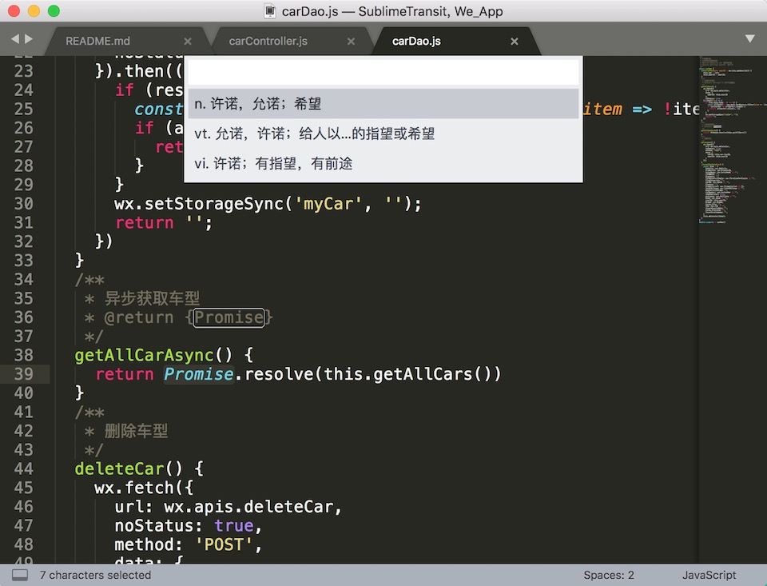
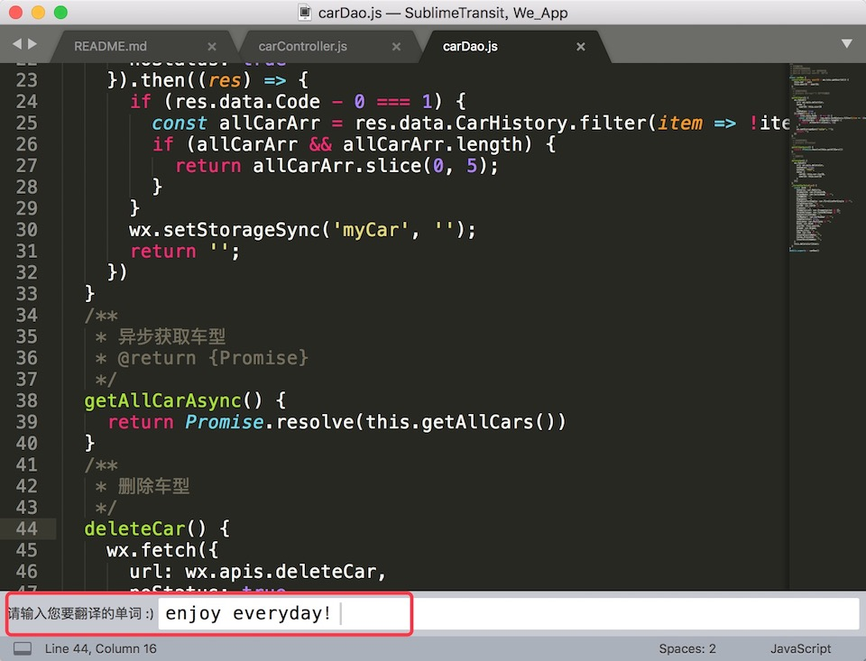
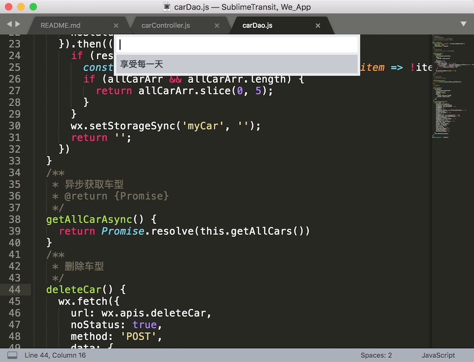

## SublimeTransit

一个在 Sublime 编辑器上翻译单词的插件。使用[有道智云](http://ai.youdao.com/docs/doc-trans-api.s#p02)提供的翻译 api 实现。

tip: 有道智的翻译服务是收费服务，具体收费可参加其[文档](http://ai.youdao.com/docs/doc-trans-price.s#p03)

建议自己注册一个账号，获取 appKey 和 secretKey，将代码里的对应的 appKey 和 secretKey 换成自己的。（按一个单词 10 个字符来算，新人可免费翻译近 21 万个单词，一天翻译 100 个，可以免费用近 6 年鸟~）


## 效果







## 如何使用

- 快捷键

```python
# MacOs:
command + shift + t 翻译选中的文本
command + shift + y 翻译输入的文本

# Windows & Linux
ctrl + shift + t 翻译选中的文本
ctrl + shift + y 翻译输入的文本
```

- 右击，显示快捷菜单，选中 Translate
  - current text  翻译选中的文本
  - input text    翻译输入的文本

## 安装
直接下载压缩包，解压到 Sublime 的 Packages 中，即可使用。

## 配置

你可以在 Preferences --> Package Settings --> SublimeTransit --> Settings - Default 下进行插件配置
```js
{
    "translate_whole_word": false,//全词翻译，当你选择了单词的一个部分，也会翻译整个单词
}
```
